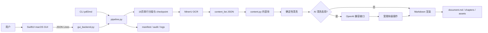

# 架构说明

> 文档状态：已验证事实｜最后验证：2026-08-01

系统由三个边界组成：

| 边界 | 职责 | 不负责 |
|---|---|---|
| SwiftUI | 文件选择、参数输入、状态展示 | OCR、模型调用、正文处理 |
| Python 后端 | 编排、清洗、渲染、追溯、事件输出 | GUI 绘制 |
| 外部/本地模型 | OCR 或块级结构判断 | 直接写最终 Markdown |

输出采用暂存目录完成，只有全部分段成功、页码覆盖完整且 Markdown/资源生成完成后才原子发布到目标目录；失败现场改名为 `.failed-时间戳`，可通过输入哈希匹配后续跑。
