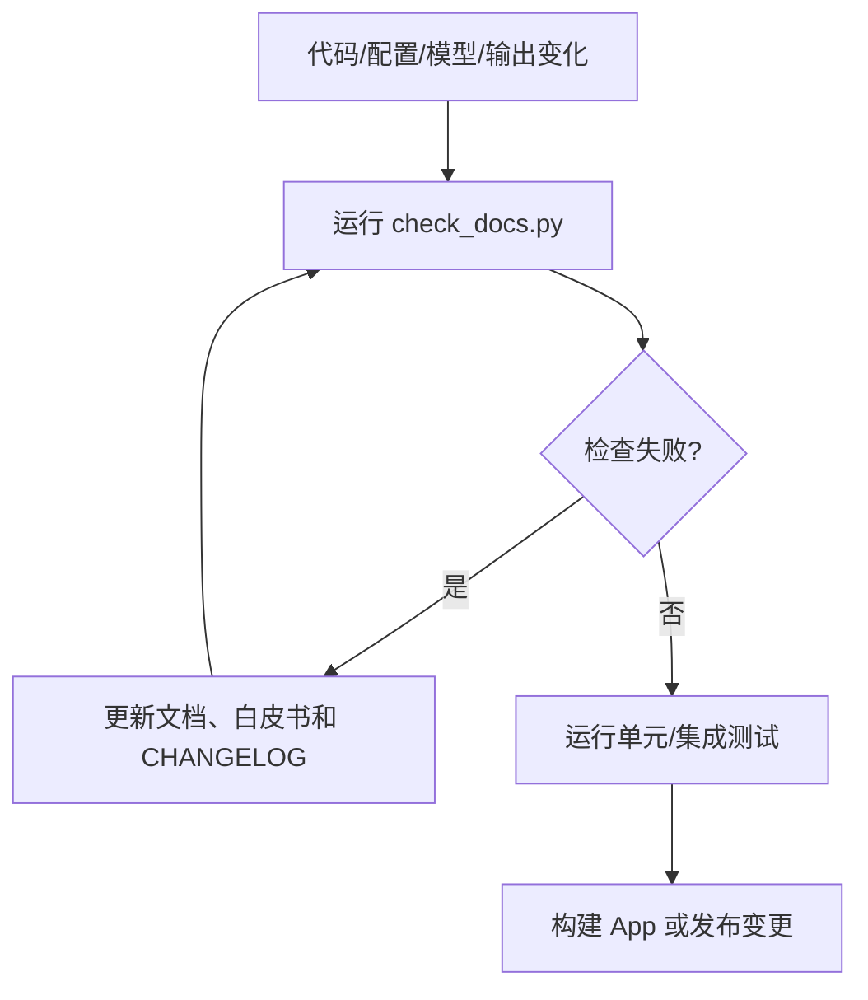

# 文档维护机制

> 文档状态：设计约束｜最后验证：2026-08-01

代码、配置、模型、输出结构、GUI 事件或错误处理发生变化时，修改必须同时检查文档中心。`scripts/check_docs.py` 是门禁入口，返回非零即表示文档不完整或过时。

```mermaid
flowchart TD
    CHANGE[代码/配置/模型/输出变化] --> IMPACT[运行 check_docs.py]
    IMPACT --> FAIL{检查失败?}
    FAIL -->|是| UPDATE[更新文档、白皮书和 CHANGELOG]
    UPDATE --> IMPACT
    FAIL -->|否| TEST[运行单元/集成测试]
    TEST --> RELEASE[构建 App 或发布变更]
```

提交前清单：更新受影响文档、更新最后验证日期、运行文档检查、运行测试、若白皮书变化则重新生成 PDF 并检查 PDF 文本与渲染。
