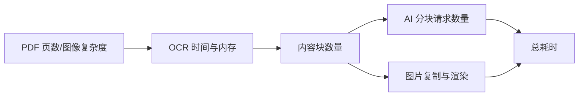

# 性能与瓶颈

> 文档状态：已验证事实｜最后验证：2026-08-01

主要耗时来自 MinerU OCR，其次是图片复制、可选 AI 分块请求和 Markdown 写入。长文档现在按默认 16 页分段、串行启动 MinerU，降低单次内存峰值并允许失败后续跑。

可观测指标写入 `manifest.json`、`job_manifest.json` 和日志：页数、分段数、已完成页数、每段耗时、RSS 峰值、内容块数量、章节数、资源数、总耗时、超时值、处理窗口和模型诊断。当前没有承诺固定吞吐量，任何性能数字必须绑定 PDF 页数、扫描质量、硬件和模型源。
