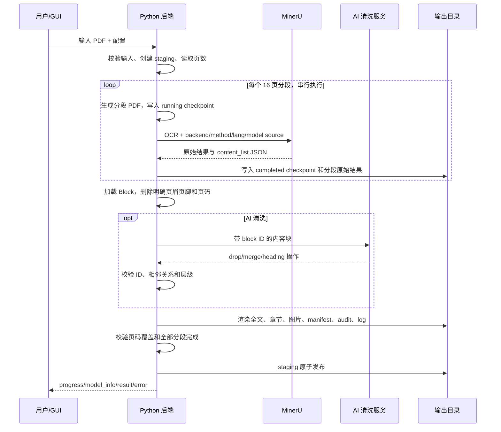
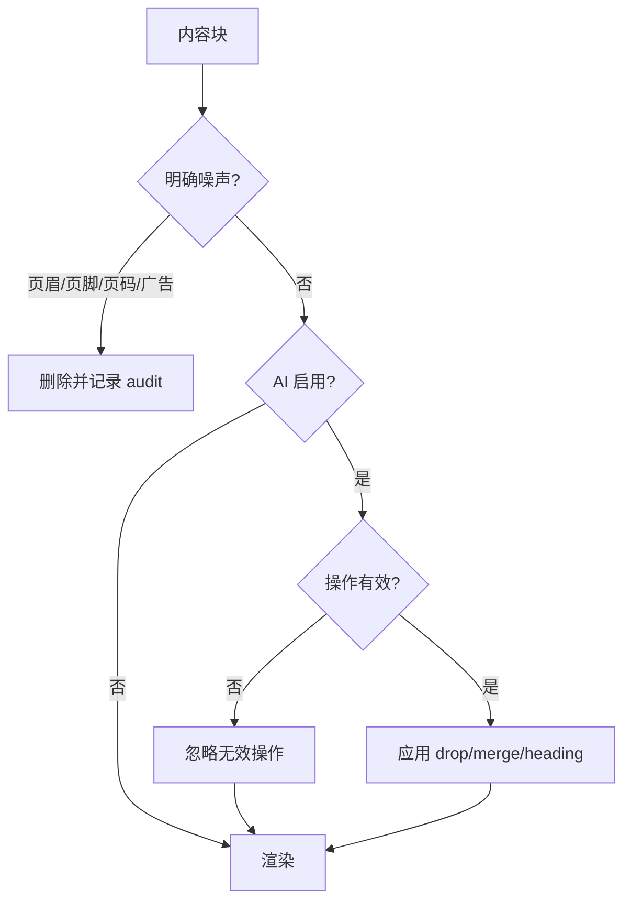

# 转换流程

> 文档状态：已验证事实｜最后验证：2026-08-01

```mermaid
sequenceDiagram
    participant User as 用户/GUI
    participant Backend as Python 后端
    participant MinerU as MinerU
    participant AI as AI 清洗服务
    participant FS as 输出目录
    User->>Backend: 输入 PDF + 配置
    Backend->>Backend: 校验输入、创建 staging、读取页数
    loop 每个 16 页分段，串行执行
        Backend->>Backend: 生成分段 PDF，写入 running checkpoint
        Backend->>MinerU: OCR + backend/method/lang/model source
        MinerU-->>Backend: 原始结果与 content_list JSON
        Backend->>FS: 写入 completed checkpoint 和分段原始结果
    end
    Backend->>Backend: 加载 Block，删除明确页眉页脚和页码
    opt AI 清洗
        Backend->>AI: 带 block ID 的内容块
        AI-->>Backend: drop/merge/heading 操作
        Backend->>Backend: 校验 ID、相邻关系和层级
    end
    Backend->>FS: 渲染全文、章节、图片、manifest、audit、log
    Backend->>Backend: 校验页码覆盖和全部分段完成
    Backend->>FS: staging 原子发布
    Backend-->>User: progress/model_info/result/error
```

清洗遵循“宁可保留可疑正文，不误删”的原则。AI 没有 `replacement_text` 能力，正文只来自 MinerU 内容块和确定性合并。

```mermaid
flowchart TD
    I[内容块] --> D{明确噪声?}
    D -->|页眉/页脚/页码/广告| DROP[删除并记录 audit]
    D -->|否| R{AI 启用?}
    R -->|否| OUT[渲染]
    R -->|是| V{操作有效?}
    V -->|否| KEEP[忽略无效操作]
    V -->|是| APPLY[应用 drop/merge/heading]
    KEEP --> OUT
    APPLY --> OUT
```
