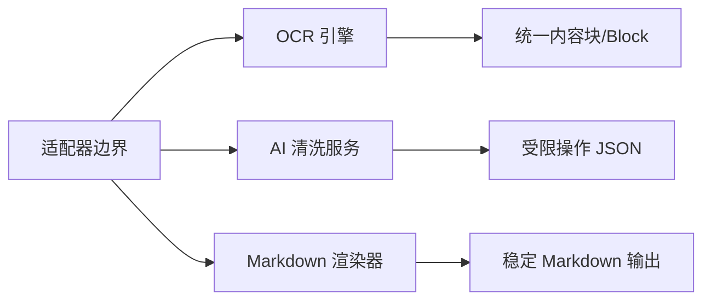

# 可替换项

> 文档状态：设计约束｜最后验证：2026-08-01

| 可替换项 | 当前实现 | 替换边界 |
|---|---|---|
| OCR 引擎 | MinerU CLI | 必须产出可定位的结构化内容块或增加适配器 |
| AI 清洗服务 | OpenAI 兼容 Chat Completions | 必须返回受限 JSON 操作；不得直接替换正文 |
| Markdown 渲染 | `content.render_markdown` | 必须保留图片、表格、公式和章节链接 |
| GUI | SwiftUI + JSONL | 新 UI 需继续消费稳定事件协议 |
| 模型源 | ModelScope/HuggingFace/local | 由 MinerU 支持范围决定，不由本项目下载器决定 |

替换时必须更新 `models.md`、`configuration.md`、`dependencies.md`、`known-issues.md` 和测试样例。

